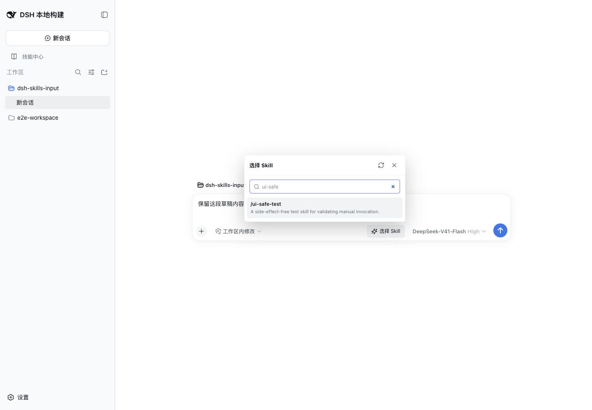
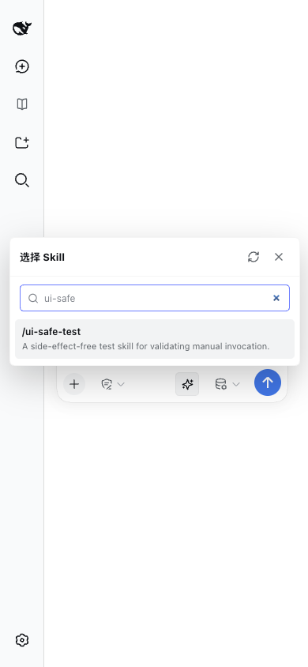
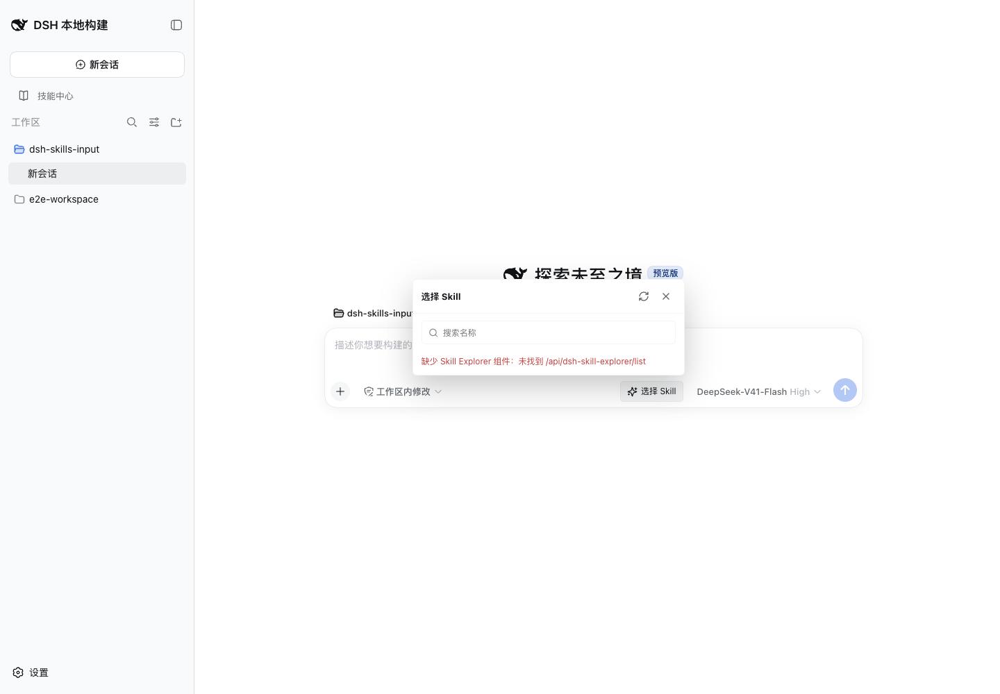

<div align="center">

# dsh-skills-input

**在 dsh composer 里搜索并选择 Skill，把真实调用指令安全地放进草稿。**

面向不熟悉命令的用户：看名称、读描述、选中 Skill，确认草稿后再发送。

<p>
  <a href="https://github.com/konglong87/dsh-skills-input/releases"></a>
  <a href="https://github.com/konglong87/dsh-skills-input/blob/main/LICENSE"></a>
  <a href="https://github.com/konglong87/dsh-skills-input/stargazers"></a>
  <a href="https://github.com/konglong87/dsh-skills-input/issues"></a>
</p>

<p>
  <a href="#安装">立即安装</a>
  ·
  <a href="#亮点">查看亮点</a>
  ·
  <a href="#效果">查看效果</a>
  ·
  <a href="https://github.com/konglong87/dsh-skills-input/releases">下载 Release</a>
</p>

</div>

## 安装

### 1. 安装插件

在已经安装 dsh 的环境中执行：

```bash
dsh plugin --profile web add github:konglong87/dsh-skills-input
```

### 2. 安装依赖

本插件采用**方案 A：复用现有 Skill Explorer**。请同时安装并启用一个真正提供下面接口的 Skill Explorer 组件：

```text
GET /api/dsh-skill-explorer/list?cwd=<当前会话 cwd>
```

然后重启 web profile：

```bash
dsh --profile web
```

需要指定端口时：

```bash
dsh --profile web --port 3080 --no-open
```

> 重要：这里要求的是提供 `/api/dsh-skill-explorer/list` 接口的 **Skill Explorer**。
> 不要假定所有名为 “Skill Manager” 的插件都兼容。本插件不会扫描磁盘，不会新建 Skill 数据库，也不会提供 Skill 管理后台。

## 项目简介

`dsh-skills-input` 是一个独立的 dsh composer 插件，在输入框右侧增加“选择 Skill”按钮。

它读取当前会话可见的 Skill 目录，展示真实的 Skill 名称和描述；用户选中后，插件把宿主实际识别的 `/skill-name ` 调用指令写入草稿。原有内容会保留，消息不会自动发送，最终发送权始终交给用户。

## 亮点

| 亮点 | 说明 |
| --- | --- |
| **低门槛选择** | 用可搜索列表替代记忆斜杠命令，直接查看真实名称和描述 |
| **上下文隔离** | 按当前会话 cwd 和项目根目录过滤，不把其他工作区的 Skill 混进来 |
| **只展示可手动调用项** | 过滤 `userInvocable === false` 的模型专用 Skill，不编造权限标签 |
| **复用官方上下文** | 直接复用 Skill Explorer 的目录接口，不扫描磁盘、不维护第二份 Skill 数据 |
| **真实宿主语法** | `/skill-name` 已从 dsh 源码和真实页面验证，发送后由宿主注入 Skill instructions |
| **草稿优先** | 保留原有草稿、不自动发送；重复选择同一个 Skill 不会重复插入 |
| **歧义保护** | 草稿首个非空命令行已有其他斜杠命令时，提示冲突并停止插入 |
| **故障可识别** | 依赖缺失、接口失败、空目录分别呈现，不把依赖问题伪装成“没有 Skill” |
| **适合日常使用** | 支持搜索、刷新、键盘操作、焦点恢复、移动端和暗色模式 |
| **独立且易维护** | client、catalog、model、panel 分层，不修改 dsh 核心，也不依赖 `dsh-input-list` 运行时 |

## 效果

以下截图来自真实 dsh 页面，使用隔离测试环境和无外部副作用的测试 Skill。

<div align="center">
  
  <br>
  <sub>桌面端：打开面板、搜索 Skill、查看描述并完成选择</sub>
</div>

<br>

<div align="center">
  
  <br>
  <sub>移动端：面板适配窄屏，选择后保留原草稿</sub>
</div>

<br>

<div align="center">
  
  <br>
  <sub>依赖缺失：明确提示需要 Skill Explorer，不误显示为空列表</sub>
</div>

## 使用

1. 打开 dsh 对话页面，点击输入框右侧的“选择 Skill”。
2. 在搜索框输入名称片段，使用鼠标或键盘选择目标 Skill。
3. 查看真实名称和描述后确认选择。
4. 插件把 `/skill-name ` 写入当前草稿，并保留原有内容。
5. 检查草稿，确认无误后由用户自行发送。

键盘操作：

| 按键 | 操作 |
| --- | --- |
| `↑` / `↓` | 在结果中移动 |
| `Enter` | 选择当前 Skill |
| `Escape` | 关闭面板并恢复按钮焦点 |

V1 采用单选模型，一次只插入一个 Skill 调用指令。列表和草稿都不会被插件持久化。

## 兼容边界

### 必须提供的接口

Skill Explorer 接口返回的目录至少需要包含：

- 顶层：`cwd`、`projectRoots`、`groups`
- 分组：`groups[].skills[]`
- Skill：`name`、`description`、`userInvocable`
- 项目级 Skill：建议提供 `path` 和 `level`

插件会使用 `projectRoots`、当前会话 cwd 和 Skill 的路径信息判断作用域。当前列表只保留：

- 当前会话上下文内的 Skill
- `userInvocable !== false` 的 Skill
- 名称格式符合 dsh Skill 调用规则的 Skill
- 去重后的 Skill 名称

### 宿主契约

以下行为已经从当前 dsh 源码和真实页面核实：

- 插槽：`conversation.input.right`
- Client inject：`slots`、`sessions`
- 当前工作目录：`sessions.list.getSnapshot().byId[sessionId].cwd`
- 请求鉴权：浏览器同源请求，使用 `credentials: "same-origin"`，不添加自定义鉴权头
- 草稿写回：composer 提供的 `inputActions.setDraft()`
- Skill 调用：首个符合边界的 `/skill-name` 文本，由 dsh 在 `agent/pre-step` 阶段注入 Skill instructions

## 不做什么

本插件只负责“发现、选择、回填草稿”，不负责 Skill 生命周期管理。它不提供：

- Skill 安装、编辑或删除
- Skill 管理后台
- 独立 Skill 数据库
- 多 Skill 编排
- 自动发送
- dsh 核心补丁

## 开发与验证

```bash
git clone https://github.com/konglong87/dsh-skills-input.git
cd dsh-skills-input
npm ci
npm run build
npm test
npm pack --dry-run
```

目录职责：

| 路径 | 职责 |
| --- | --- |
| `src/client.jsx` | Cordis 注入、插槽注册和生命周期清理 |
| `src/catalog.js` | Skill Explorer 请求入口和目录接口封装 |
| `src/model.js` | 纯函数：标准化、作用域过滤、去重、搜索、草稿处理 |
| `src/panel.jsx` | 按钮、列表、状态、键盘交互和焦点管理 |
| `src/styles.css` | 桌面、移动端和暗色主题样式 |
| `src/host.js` | dsh Host 入口 |
| `tests/` | 目录解析、过滤、搜索、草稿和卸载测试 |

验证记录见 [docs/VERIFICATION.md](docs/VERIFICATION.md)，截图索引见 [screenshots.json](screenshots.json)。真实 dsh 验收覆盖桌面端、移动端、草稿保留、重复选择、依赖缺失、接口失败、工作区切换、宿主识别和插件卸载。

## 更新与卸载

更新 GitHub 安装：

```bash
dsh plugin --profile web add github:konglong87/dsh-skills-input
```

查看已安装插件：

```bash
dsh plugin --profile web list
```

卸载插件：

```bash
dsh plugin --profile web remove dsh-skills-input
```

更新或卸载后请重启对应的 dsh profile。

## 版本与协议

- 当前版本：`0.1.0`
- [版本记录](CHANGELOG.md)
- [验证记录](docs/VERIFICATION.md)
- [MIT License](LICENSE)

反馈问题时请附 dsh 版本、插件版本、安装方式、复现步骤和脱敏截图。请不要上传登录 token、API Key 或个人会话内容。
